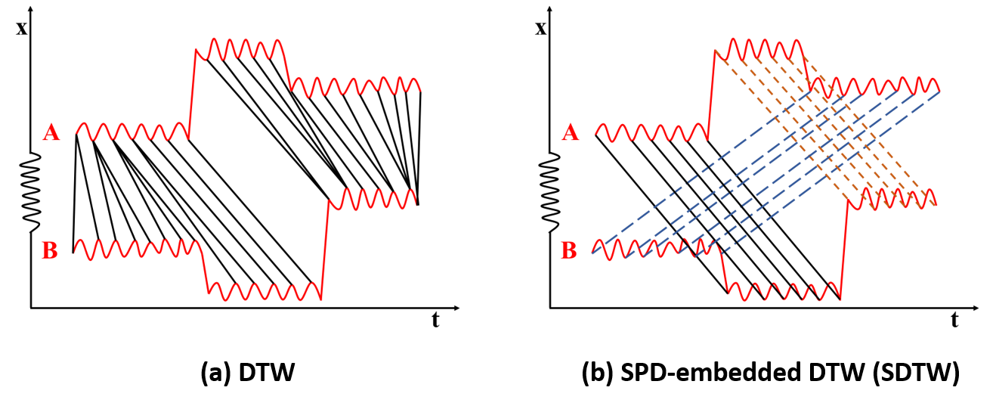

# Segmented-Pairwise-Distance
The paper of this project, named ***Segmented Pairwise Distance for Time Series with Large Discontinuities***, was accepted by WCCI (IJCNN) 2020. SPD is orthogonal to distance-based algorithms and can be embedded in them. We validate advantages of SPD-embedded algorithms over corresponding distance-based ones on both open datasets and a proprietary dataset of surgical time series (of
surgeons performing a temporal bone surgery in a virtual reality surgery simulator). Experimental results demonstrate that SPD-embedded algorithms outperform corresponding distance-based ones in distance measurement between time series with large discontinuities, measured by the Silhouette index (SI).

## Prerequisites
Matlab

## Baselines
DTW, CIDTW, DDTW, WDTW and WDDTW

## Corresponding SPD-embedded algorithms
SDTW, SCIDTW, SDDTW, SWDTW and SWDDTW

## Datasets

### Published dataset
* Cortical mastoidectomy (CM) dataset in [workspace_cm.mat](workspace_cm.mat)

### Open datasets
* [Activity recognition (AG) dataset](http://archive.ics.uci.edu/ml/datasets/Activity+Recognition+from+Single+Chest-Mounted+Accelerometer)
* [Indoor user movement (IUM) dataset](http://archive.ics.uci.edu/ml/datasets/Indoor+User+Movement+Prediction+from+RSS+data)

## Notes

Only Matlab codes for the our collected CM dataset is published. Readers can easily apply them to other datasets including the [AG dataset](http://archive.ics.uci.edu/ml/datasets/Activity+Recognition+from+Single+Chest-Mounted+Accelerometer) and the [IUM dataset](http://archive.ics.uci.edu/ml/datasets/Indoor+User+Movement+Prediction+from+RSS+data).

## License
This project is licensed under the MIT License - see the [LICENSE](LICENSE) file for details
